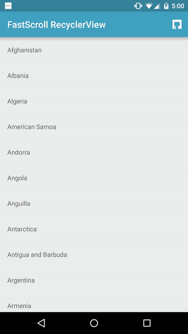

#  FastScroll-RecyclerView 

[](https://maven-badges.herokuapp.com/maven-central/com.jaredrummler/fastscroll-recyclerview) [](LICENSE) [](https://android-arsenal.com/api?level=14)



Usage
-----

Add the view to your layout:

```xml
<com.jaredrummler.fastscrollrecyclerview.FastScrollRecyclerView
    android:id="@+id/recycler"
    xmlns:android="http://schemas.android.com/apk/res/android"
    xmlns:app="http://schemas.android.com/apk/res-auto"
    android:layout_width="match_parent"
    android:layout_height="match_parent"
    app:fastScrollHideDelay="600"
    app:fastScrollAlwaysEnabled="false"
    app:fastScrollPopupBackgroundColor="?attr/colorAccent"
    app:fastScrollPopupTextColor="@android:color/white"
    app:fastScrollThumbActiveColor="?attr/colorAccent"
    app:fastScrollThumbInactiveColor="?attr/colorAccent"/>
```

Create a `RecyclerView.Adapter` that extends `FastScrollRecyclerView.SectionedAdapter`:

```java
private static class RecyclerAdapter extends RecyclerView.Adapter<RecyclerAdapter.ViewHolder>
    implements FastScrollRecyclerView.SectionedAdapter {

  private final String[] countries;

  public RecyclerAdapter(String[] countries) {
    this.countries = countries;
  }

  ...

  @NonNull @Override public String getSectionName(int position) {
    return countries[position].substring(0, 1).toUpperCase(Locale.ENGLISH);
  }

}
```

Download
--------

Download [the latest AAR](https://repo1.maven.org/maven2/com/jaredrummler/fastscroll-recyclerview/1.0.3/fastscroll-recyclerview-1.0.3.aar) or grab via Gradle:

```groovy
compile 'com.jaredrummler:fastscroll-recyclerview:1.0.3'
```
or Maven:
```xml
<dependency>
  <groupId>com.jaredrummler</groupId>
  <artifactId>fastscroll-recyclerview</artifactId>
  <version>1.0.3</version>
  <type>aar</type>
</dependency>
```

Credits
-------

This library is based on [Google's Launcher3](https://android.googlesource.com/platform/packages/apps/Launcher3/) fast scroller.

Some of the code in this library is from [Tim Malseed's](https://github.com/timusus) project [RecyclerView-FastScroller](https://github.com/timusus/RecyclerView-FastScroll)

License
--------

    Copyright (C) 2016 Jared Rummler

    Licensed under the Apache License, Version 2.0 (the "License");
    you may not use this file except in compliance with the License.
    You may obtain a copy of the License at

       http://www.apache.org/licenses/LICENSE-2.0

    Unless required by applicable law or agreed to in writing, software
    distributed under the License is distributed on an "AS IS" BASIS,
    WITHOUT WARRANTIES OR CONDITIONS OF ANY KIND, either express or implied.
    See the License for the specific language governing permissions and
    limitations under the License.
